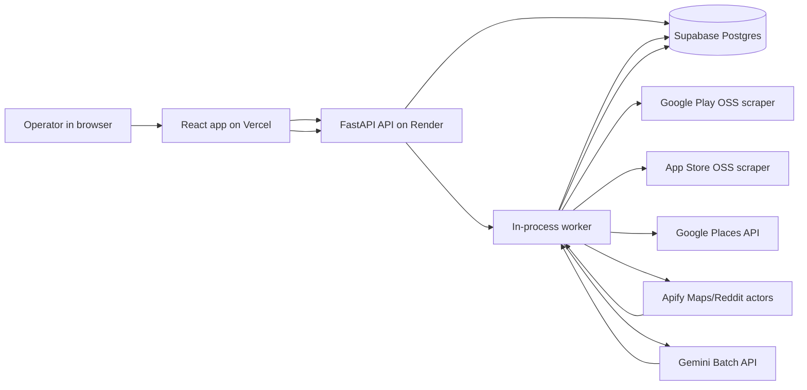

# Voice of Customer Platform - Technical PM Learning Guide

Last updated: 2026-06-15

This document explains the technical stack used in the VoC platform, why each piece exists, how data moves through the system, what can fail, and how to reason about operations/costs. It is written for a technical PM who understands APIs and databases but wants to understand the infrastructure and engineering choices well enough to manage, debug, and evolve the product.

## 1. Product In One Sentence

The platform takes a company plus public review links, collects recent low-rated customer feedback, classifies it into L1 themes and L2 sub-issues using Gemini Batch, stores everything in Supabase Postgres, and shows a dashboard/results page with quotes, exports, costs, and a deck spec.

## 2. The Main Pieces

| Layer | Technology | Why it exists | What to know as PM |
| --- | --- | --- | --- |
| Frontend | React + Vite, hosted on Vercel | Browser UI for submissions, run tracking, charts, tables, exports | Vercel serves static files globally. It does not run the long scraping/classification jobs. |
| Backend API | FastAPI + Uvicorn, hosted on Render | REST API for creating runs, polling status, fetching results, downloads, logs | Render keeps a long-running Python process alive. This is needed because jobs can take minutes. |
| Worker | In-process async worker inside FastAPI app | Processes queued runs sequentially | The worker watches Postgres for `queued` runs and processes one company at a time. |
| Database | Supabase Postgres | System of record for companies, runs, reviews, themes, settings, logs | Everything important is persisted here. If the UI disagrees with DB, DB wins. |
| Store ingestion | OSS Node libraries | Pulls Play Store and App Store reviews without paid Apify cost | These run from backend code through Node packages. |
| Maps ingestion | Google Places API + Apify Maps scraper | Finds correct physical locations and scrapes Maps reviews | Places API resolves place IDs; Apify gets review volume. |
| Reddit ingestion | Apify Reddit actor, optional | Can fetch social posts but quality/cost was weak | Keep optional. It is not part of the default recommended workflow. |
| LLM | Gemini 3.1 Flash-Lite Batch API | Discovers L1/L2 taxonomy and classifies reviews | Batch is cheaper and avoids sync rate-limit pain. |
| Deployment CI | GitHub + GitHub Actions + Render API | Push code, run tests, deploy backend | GitHub is the source of truth. Render deployment may need manual/API trigger if autodeploy is off. |

## 3. High-Level Architecture



The important idea: Vercel is only the UI. Render owns the long-running backend process. Supabase is the memory of the product.

## 4. Runtime Flow

### 4.1 Submit A Company

The operator enters:

| Field | Example | Used for |
| --- | --- | --- |
| Company name | Snabbit | Display, matching, query labels |
| Play Store URL | `play.google.com/store/apps/details?id=...` | Extract Play app ID |
| App Store URL | `apps.apple.com/.../id...` | Extract App Store app ID |
| Website | `https://snabbit.com` | Extract domain and brand keyword |
| Maps toggle/location | enabled, Bangalore India | Decide whether to run Maps |
| Reddit toggle | false | Decide whether to run Reddit |

Backend creates or updates a `companies` row and creates a `runs` row with status `queued`.

### 4.2 Queue Model

Current v1 queue is simple:

| Concept | Implementation |
| --- | --- |
| Queue | `runs.status = 'queued'` in Postgres |
| Worker | Python async loop in `backend/app/pipeline/worker.py` |
| Concurrency | One company at a time |
| Why sequential | Cost control, lower provider stress, easier overnight operation |
| Job dedup | If same company has active run, API returns existing active run |
| Global worker lease | `worker_leases` table prevents two backend processes from owning the queue at once |

This is not a separate queue service like Redis/RQ/Celery. It is enough for v1 because overnight throughput is modest and the worker state is persisted in Postgres.

### 4.2.1 Worker Lease

Render deploys can briefly overlap old and new backend processes. Without a global lock, both processes can start worker loops and claim queue work. The fix is a database-backed lease:

| Lease concept | Meaning |
| --- | --- |
| Lease row | One row in `worker_leases`, named `voc_pipeline_worker` |
| Owner | Random worker instance ID |
| `locked_until` | Expiry time; if the owner dies, another process can take over later |
| Renewal | Active owner renews the lease every 30 seconds |
| Lease duration | 5 minutes |

This keeps the product's operational model sequential even if hosting infrastructure temporarily runs two backend processes during a deploy.

### 4.3 Run Stages

| Stage | Status/log signal | What happens |
| --- | --- | --- |
| Queue | `run_queued` | Run row created |
| Scraping | `scraping` | Store/Maps/optional Reddit reviews collected |
| Cleaning | `dedup_completed` | Text normalized, duplicates removed, only 1/2/3-star rated reviews selected |
| Theme discovery | `theme_discovery` | Gemini creates L1/L2 taxonomy from selected reviews |
| Classification | `classification` | Gemini assigns every selected row to L1/L2 |
| Synthesis | `themes_built` | Counts, shares, top quotes, source ROI built |
| Terminal | `done`/`partial`/`failed` | Run is completed or failed |

## 5. Frontend: React On Vercel

### What Vercel Does

Vercel hosts the compiled frontend as static assets:

| Thing | Meaning |
| --- | --- |
| Build output | HTML/CSS/JS files generated by Vite |
| Production URL | `https://frontend-eight-sandy-65.vercel.app` |
| Vercel cache | Serves unchanged assets fast |
| API calls | Browser calls Render backend, not Vercel functions |

### Why Vercel Is Not The Backend

The pipeline can take several minutes per company. Serverless functions are not a good fit for long scraping/LLM jobs. So Vercel is only the UI shell.

### Important UI Screens

| Screen | Purpose |
| --- | --- |
| Dashboard | Active runs, run history, spend/capacity, rerun/delete |
| New Analysis | Submit company |
| Results page | Company-level themes, L1/L2 tree, source ROI, tagged reviews, downloads, deck spec |

## 6. Backend: FastAPI On Render

### What FastAPI Does

FastAPI exposes REST endpoints:

| Endpoint | Purpose |
| --- | --- |
| `GET /health` | Health check for Render and humans |
| `POST /api/runs` | Create a company run |
| `GET /api/runs` | List run history |
| `GET /api/runs/{id}` | Poll one run |
| `POST /api/runs/{id}/rerun` | Create complete rerun for same company |
| `DELETE /api/runs/{id}` | Delete non-active run |
| `GET /api/runs/{id}/results` | Full results payload |
| `GET /api/runs/{id}/reviews` | Paginated/filterable tagged reviews |
| `GET /api/runs/{id}/logs` | Detailed journey logs |
| `GET /api/runs/{id}/downloads/{fmt}` | JSON/CSV/XLSX exports |
| `GET /api/runs/{id}/deck-spec.md` | Markdown deck spec |

### What Render Does

Render runs the Python backend as a web service:

```bash
uvicorn app.main:app --host 0.0.0.0 --port $PORT
```

Render gives the app:

| Render concept | Meaning |
| --- | --- |
| Service | The deployed backend app |
| Deploy | A build/release from a Git commit |
| Env vars | Secrets/config injected into the process |
| Health check | Render pings `/health` |
| Logs | stdout/stderr from backend |

### Why Render Instead Of Vercel Functions

The worker polls Gemini Batch and waits for scrapers. A job can take minutes. Render gives us a long-lived process; Vercel functions are optimized for request/response work.

## 7. Supabase Postgres

### What Supabase Is Here

Supabase is managed Postgres. We use it as a normal database, not as a frontend client database.

The backend connects using the Supabase pooler:

| Piece | Meaning |
| --- | --- |
| Host | Supabase pooler host |
| Port | Transaction pooler port, usually 6543 |
| Database | `postgres` |
| User/password | Database login credentials |
| Pooler | Sits between app and database to manage connections |

### Why The Password Matters

The database password is not an app login. It is the credential that lets the backend connect to Postgres. Anyone with it can potentially read/write the DB if network/project rules allow it. That is why it belongs only in Render env vars or local `.env`, not in GitHub.

### Tables

| Table | Purpose |
| --- | --- |
| `companies` | One row per company/app/domain |
| `runs` | One row per pipeline run |
| `reviews` | Tagged review rows for a run |
| `themes` | Aggregated L1 themes and nested L2 subthemes |
| `settings` | Provider/model/max reviews/budget settings |
| `run_logs` | Journey logs, costs, retries, token usage, failure reasons |

### Important Data Ownership Rule

The backend owns database writes. The frontend never talks directly to Supabase. This keeps secrets out of the browser and keeps business logic centralized.

## 8. SQLAlchemy And Psycopg

The backend uses:

| Library | Role |
| --- | --- |
| SQLAlchemy | Python ORM/query layer |
| psycopg | Postgres driver |

SQLAlchemy maps Python classes like `Run`, `Review`, and `Theme` to tables. Psycopg is the lower-level driver that actually talks to Postgres.

One production detail: Supabase transaction pooler does not preserve backend sessions for prepared statements, so the app disables automatic psycopg preparation with `prepare_threshold=None`.

## 9. Ingestion Sources

### Play Store

| Detail | Current behavior |
| --- | --- |
| Tool | `facundoolano/google-play-scraper` |
| Cost | Free from our app perspective |
| Language | Pulls Hindi + English where configured |
| Selection | Low-rated 1/2/3-star reviews only |
| Cap | Settings max reviews, currently 5000 |

### App Store

| Detail | Current behavior |
| --- | --- |
| Tool | `facundoolano/app-store-scraper` |
| Cost | Free from our app perspective |
| Cap | 500 raw reviews |
| Selection | Low-rated 1/2/3-star reviews only |

### Google Maps

Maps is two-step:

1. Google Places API finds correct place IDs.
2. Apify Maps scraper pulls review volume from those places.

| Detail | Current behavior |
| --- | --- |
| Places API | Used for entity resolution, not review volume |
| Query | Brand + India/location hint |
| Maps scraper | Apify `compass/google-maps-reviews-scraper` |
| Sort | Lowest rating |
| Cap | 100 reviews |
| Cost | Around USD 0.0006/review from Apify event pricing |

### Reddit

Reddit is optional and currently not recommended as default.

| Reason | Practical impact |
| --- | --- |
| Cost per useful row can be high | Bad ROI for many brands |
| Search quality varies | Many irrelevant posts |
| Useful for very public brands only | Keep as opt-in |

## 10. Cleaning, Dedup, And Selection

### Cleaning

Text is normalized before storage/classification:

| Step | Why |
| --- | --- |
| Collapse whitespace | Cleaner prompts and UI |
| Remove NUL/control chars | Postgres rejects NUL bytes |
| Drop empty reviews | Avoid wasting Gemini tokens |

The 2026-06-15 Noon failure happened because a scraped review contained a NUL byte. Postgres rejected the insert. This is now fixed at the cleaner layer.

### Dedup

The app uses MinHash/LSH:

| Concept | Meaning |
| --- | --- |
| Exact dedup | Same source/text/date hash |
| Near dedup | Similar review text detected by MinHash |
| Why not embeddings | Dedup should remove near-identical spam, not semantic themes |

### Selection

Only reviews likely to contain problems are sent into analysis:

| Source type | Selection rule |
| --- | --- |
| Rated sources | Rating 1, 2, or 3 |
| Reddit | Included if enabled, because posts do not have app-store star ratings |

## 11. Gemini And Batch API

### Why Gemini Batch

| Path | Pros | Cons |
| --- | --- | --- |
| Sync API | Immediate response | More rate-limit pressure, higher cost |
| Batch API | Cheaper, async, fewer rate problems | Can take longer and needs polling |

The product currently uses Gemini Batch by default and records `sync_fallback=false`.

### Prompt Shape

Taxonomy discovery input:

```json
{
  "task": "discover_l1_l2_taxonomy",
  "reviews": [[1, 1, "review text"]],
  "row_format": "[row_id, rating, text]"
}
```

Classification input:

```json
{
  "task": "classify_reviews_l1_l2",
  "theme_set": [{"l1_theme": "booking_unavailability", "l2_subthemes": ["slots_always_full"]}],
  "reviews": [[1, 1, "review text"]],
  "output_format": "[row_id, l1_theme, l2_theme]"
}
```

Classification output:

```json
[
  [1, "booking_unavailability", "slots_always_full"]
]
```

Fields removed to reduce token cost:

| Removed field | Why |
| --- | --- |
| `source` | Not needed for classification |
| `date` | Not needed for L1/L2 |
| `review_hash` | Replaced by compact row ID |
| `language` | Not needed downstream |
| `english_gloss` | Good for readability but expensive; raw quotes are acceptable |
| `severity` | Removed by product decision |
| `bucket` | Product moved to pure L1/L2 |

## 12. L1/L2 Theme Model

The current product model is:

```text
L1 theme -> L2 sub-issue -> review rows and quotes
```

Example:

| L1 | L2 |
| --- | --- |
| `booking_unavailability` | `slots_always_full` |
| `booking_unavailability` | `service_not_available_in_area` |
| `refund_and_payment_issues` | `denied_or_delayed_refunds` |

Quality gate:

| Metric | Target |
| --- | --- |
| L1 `other` share | Below 15% |
| Quarantine rate | Near 0% |

If L1 `other` exceeds 15%, the app runs one repair pass on the `other` rows.

## 13. Cost Model

Costs are tracked at two layers:

| Cost source | Where recorded |
| --- | --- |
| Apify | `run_logs.cost_usd`, `runs.cost_estimate` |
| Gemini | Token usage from API response, converted by pricing table |
| Play/App Store OSS | Recorded as zero direct provider cost |
| Google Places API | Not currently attributed in app cost if within free/console billing |

Current settings:

| Setting | Value |
| --- | --- |
| Model | `gemini-3.1-flash-lite` |
| Batch size | 100 |
| Max reviews | 5000 |
| Run budget cap | USD 1 |
| Maps cap | 100 |
| Reddit | Optional/off by default |

Example verified Snabbit run:

| Metric | Value |
| --- | --- |
| Classified rows | 750 |
| Gemini tokens | 96,597 |
| Gemini cost | USD 0.022958 |
| Apify Maps cost | USD 0.060000 |
| Total cost | USD 0.083000 |
| Quarantine | 0% |
| Other share | 9.73% |

## 14. Logs And Observability

The `run_logs` table is the main debugging surface.

Each log row can contain:

| Field | Meaning |
| --- | --- |
| `stage` | scraping, cleaning, theme_discovery, classification, synthesis, terminal |
| `event` | What happened |
| `status` | ok, info, warning, failed |
| `source` | play/appstore/maps/reddit/mouthshut if source-specific |
| `provider` | Gemini, Apify, OSS, etc. |
| `cost_usd` | Cost attributed to that event |
| `input_tokens` | Gemini input tokens |
| `output_tokens` | Gemini output tokens |
| `details` | JSON payload with retries, errors, places, theme set, batch progress |

The dashboard intentionally hides journey logs from the main UI, but the backend keeps them for debugging.

## 15. What Happened On 2026-06-15

### Symptoms

| Symptom | Companies |
| --- | --- |
| Stuck in `Gemini Batch in progress` for 8-10 hours | First Club, Pronto, Bazaar Now, Hyuga Lifa, Oolka, One Percent Club |
| Failed | Noon |

### Root Cause 1: Stale Active Runs

The worker runs inside the Render web process. If the process restarts or dies while a run is already `classifying`, the run remains `classifying` in Postgres. The old code only picked `queued` runs. Therefore stale active runs could sit forever.

Fix:

| Fix | Behavior |
| --- | --- |
| Stale-run recovery | If an active run has no fresh logs for 30 minutes, reset it to `queued` |
| Output cleanup | Delete partial reviews/themes before restarting that run |
| Ops log | Add `stale_active_run_requeued` with prior status and last event |

Related hardening:

| Fix | Behavior |
| --- | --- |
| Global worker lease | Prevents multiple Render processes from claiming the queue at the same time |
| Lease expiry | Lets a new process take over if the old one dies |

### Root Cause 2: Noon NUL Byte

Noon failed because a scraped review contained a NUL byte (`0x00`). Postgres text fields cannot store NUL bytes.

Fix:

| Fix | Behavior |
| --- | --- |
| Cleaner sanitizer | Removes NUL and unsafe control characters before DB insert |
| Regression test | Proves NUL-byte review text becomes safe |

## 16. Deployment Flow

### GitHub

GitHub is the code source of truth.

Common flow:

```bash
git add ...
git commit -m "Message"
git push origin main
```

### Backend Deploy

The backend deploy is Render. A push to GitHub may or may not automatically deploy depending on Render settings. If not, a deploy can be triggered via Render API.

Checks:

| Check | Purpose |
| --- | --- |
| Git commit hash | Did the right code reach GitHub? |
| Render deploy commit | Did Render deploy the same commit? |
| `/health` | Did backend boot? |
| Supabase logs | Did worker start and process queued runs? |

### Frontend Deploy

The frontend deploy is Vercel. Vercel serves the React build. Frontend changes require a Vercel deploy; backend-only changes do not.

## 17. CAP And Reliability Thinking

CAP theorem says distributed systems cannot perfectly maximize consistency, availability, and partition tolerance at the same time. For this product:

| Area | Choice |
| --- | --- |
| Source of truth | Supabase Postgres |
| Consistency | Prefer DB consistency over UI optimism |
| Availability | Partial-source success keeps runs usable when one source fails |
| Partition/failure handling | Logs, partial status, stale-run recovery |

The product should never silently pretend a failed source succeeded. It should surface completeness and continue where possible.

## 18. PM Debugging Playbook

### If A Run Is Stuck

Check:

1. Run status: `queued`, `scraping`, `classifying`, `done`, `partial`, `failed`.
2. Latest `run_logs` event.
3. Whether latest log is fresh.
4. Whether Render recently deployed/restarted.
5. Whether Gemini Batch operation is still polling.

Interpretation:

| Observation | Likely meaning |
| --- | --- |
| Fresh `batch_poll` logs | Worker is alive; wait |
| No logs for 30+ minutes | Stale active run; recovery should requeue |
| `run_failed` with provider error | Source/API failure |
| `run_failed` with DB error | Data sanitation/schema issue |

### If A Run Failed

Read `run.error` and latest `run_logs.details.error`.

Common categories:

| Error type | Meaning | Usual fix |
| --- | --- | --- |
| Gemini 429/503 | Provider throttling/outage | Retry/backoff/batch |
| Apify 400 | Actor input schema wrong | Fix actor payload |
| Apify 403 | Token/proxy/permission issue | Check Apify account/actor |
| Postgres error | Bad data or schema mismatch | Sanitize/migrate |
| Budget exceeded | Run cap hit | Reduce sources/reviews or raise cap |

### If Cost Looks Wrong

Check:

1. `runs.cost_estimate`
2. `run_logs` grouped by provider/source
3. Gemini input/output tokens
4. Apify event counts
5. Whether Reddit/Maps were enabled

## 19. What To Know Before Next Phase

Deck generation and email outreach will add new product surfaces:

| Phase | Additional tech likely needed |
| --- | --- |
| Deck rendering | PPTX generator, Gamma/Chronicle API, or Google Slides API |
| Email | Resend/SendGrid/Gmail API |
| Prospecting | Apollo API, company/contact enrichment |
| Review queue | Human approval state in DB |
| Auth | Simple allowlist or password gate |

For cold-email scale, the next important PM question is not just "can we generate insights?" It is "can we generate an accurate, approved, source-backed outbound artifact for every company without manual rework?"

## 20. Platform Hosting In PM Terms

### 20.1 What "Render" Means Here

Render is the place where the backend application runs. Think of it as a managed computer in the cloud:

| PM mental model | Engineering reality |
| --- | --- |
| "The backend is live somewhere" | Render runs a Linux container/process for the FastAPI app |
| "The API has a URL" | Render exposes `https://voc-ai-agent-api.onrender.com` |
| "The worker keeps running" | The same Python process starts a background worker loop |
| "Secrets are configured" | Render injects env vars like DB URL, Gemini key, Apify key |
| "A deploy happened" | Render built code from a Git commit and restarted the service |

Render is different from GitHub. GitHub stores code. Render runs code.

Render is different from Supabase. Supabase stores data. Render executes business logic and calls external APIs.

Render is different from Vercel in this project. Vercel serves the browser app. Render runs the API and worker.

### 20.2 What Railway Would Have Been

Railway is a similar backend/cloud hosting platform. It also deploys services, stores environment variables, shows logs, and can run long-lived server processes.

We picked Render because it was available and sufficient for this v1. A Railway version of the product would still need the same fundamentals:

| Need | Render | Railway |
| --- | --- | --- |
| Run FastAPI | Yes | Yes |
| Run long worker | Yes | Yes |
| Env vars/secrets | Yes | Yes |
| Logs | Yes | Yes |
| Git deploys | Yes | Yes |
| Product architecture change required | No | No |

So Render vs Railway is not a product decision. It is an operations/vendor decision. The product architecture remains: React frontend, FastAPI backend, Supabase database, background worker.

### 20.3 Why Vercel For Frontend

The frontend is a React/Vite app. In production, React does not run as source code. It is compiled into browser files:

| File type | Meaning |
| --- | --- |
| HTML | Entry page |
| CSS | Styling |
| JavaScript | Compiled React app logic |
| Images/fonts/assets | Static supporting files |

These are called static assets because the files can be served as-is. Vercel is excellent at this: it puts those files behind a fast global CDN, gives us a stable URL, deploy previews, rollbacks, and Git-based deployment.

Important nuance: "static frontend" does not mean "dead page." It means the files are static, but once loaded in the browser, the JavaScript app is dynamic. It calls the Render API to fetch live run status, reviews, costs, and themes.

### 20.4 Why Vercel Is Not The Backend

This product has long jobs:

| Backend task | Why it is long-running |
| --- | --- |
| Scrape reviews | Multiple external sources, retries, throttling |
| Poll Gemini Batch | Batch jobs are async and can take minutes |
| Clean/dedup/classify | Thousands of rows per company |
| Sequential overnight queue | Worker must keep claiming jobs after the user closes the tab |

Vercel can run serverless functions, but serverless request handlers are a poor fit for this worker model. The worker needs a long-lived process that keeps polling even when no browser request is active. Render gives us that.

### 20.5 Why Parcel Was Not The Backend

Parcel is a JavaScript bundler. A bundler packages frontend code and assets into optimized files.

Parcel can answer: "How do I turn source files into browser-ready HTML/CSS/JS?"

Parcel cannot answer: "Where does my FastAPI server run for 10 hours overnight?"

So Parcel is not an alternative to Render or Railway. It is closer to Vite, which we already use. The comparison is:

| Category | Examples | Used here |
| --- | --- | --- |
| Frontend bundler/build tool | Vite, Parcel, Webpack | Vite |
| Frontend hosting/CDN | Vercel, Netlify, Cloudflare Pages | Vercel |
| Backend hosting/PaaS | Render, Railway, Fly.io | Render |
| Database | Supabase Postgres, Neon, RDS | Supabase |

If the question is "Could we use Parcel instead of Vite?", yes, but it would not solve backend hosting. If the question is "Could Parcel host the API?", no.

## 21. Key Technical Decisions, Trade-Offs, And Limitations

| Decision | Why we chose it | Trade-off | When to revisit |
| --- | --- | --- | --- |
| React + Vite frontend | Fast to build, simple SPA deployment | Not server-rendered; first load waits for API data | If SEO/public pages matter |
| Vercel frontend hosting | Excellent static asset hosting, previews, CDN | Does not own long worker | Keep unless frontend needs special backend co-location |
| FastAPI backend | Strong Python ecosystem for scraping, DB, LLM orchestration | Requires a running server service | Keep |
| Render backend hosting | Long-lived process for API + worker | Service cold starts/restarts can affect latency/worker continuity | If reliability needs grow, move worker to dedicated service/queue |
| In-process worker | Simple v1, fewer moving parts | Web process and worker share lifecycle | Move to separate worker process for production scale |
| Postgres as queue | Easy, inspectable, durable | Requires careful leases/recovery; not as rich as Redis/Celery | If >10 simultaneous active jobs or strict scheduling needed |
| Sequential company processing | Cost predictable, avoids provider pressure | Overnight throughput capped by slowest company | If 100 companies/night becomes mandatory |
| Gemini Batch | Lower cost and fewer rate-limit issues | Polling complexity; async completion | Keep, but add batch watchdogs |
| OSS Play/App scrapers | Free direct provider cost | Can break if stores change markup/API behavior | Add health checks and fallback only when deliberately enabled |
| Maps optional/capped | Good hidden signal, predictable cost | Place matching can miss brands; Apify cost per review | Keep opt-in, expand only for location-heavy businesses |
| Reddit optional/off | Low ROI in current tests | May miss social signal for public brands | Enable per-company when brand has Reddit presence |
| No auth for v1 | Fast operator workflow | Public URL risk if leaked | Add basic auth before broader sharing |

## 22. Why The Dashboard And Details Page Were Slow

Measured on 2026-06-15 before the optimization:

| Endpoint | Payload | Time observed | What it means |
| --- | ---: | ---: | --- |
| `/health` | 34 bytes | 0.36s | Backend was awake and healthy |
| `/api/runs` | ~127 KB | 3.46s | Dashboard list was DB-query heavy |
| `/api/runs/{rapido}/results` | ~147 KB | 2.88s | Results payload did too much upfront |
| `/api/runs/{rapido}/reviews?page=1&page_size=50` | ~33 KB | 0.99s | Paginated reviews were healthier |

### 22.1 Dashboard Root Cause

The dashboard endpoint loaded up to 250 runs. For each run, it separately fetched the latest log to compute the current stage label.

That is an N+1 query problem:

```text
1 query: get runs
+ N queries: get latest log per run
= slow dashboard as history grows
```

At 37 runs this was already noticeable. At 100+ companies it would become worse.

Fix applied:

| Before | After |
| --- | --- |
| One latest-log query per run | One bulk latest-log query for all visible runs |
| Runtime grows with run count and DB round trips | Runtime still grows with rows, but avoids repeated network round trips |

### 22.2 Details Page Root Cause

The results page had two separate issues:

| Issue | Why it slowed first load |
| --- | --- |
| Results endpoint loaded all reviews | Needed summary/deck calculations, but table itself is paginated |
| Results endpoint returned all logs | UI only needed provider cost totals, not full journey logs |
| Summary was computed twice | Once for page summary, again inside deck-spec generation |

Fix applied:

| Before | After |
| --- | --- |
| Full logs included in `/results` | Logs removed from first payload |
| Cost split derived from full logs in browser | Backend sends compact `summary.cost_rollup` |
| Summary computed twice | Summary reused for deck-spec |

Remaining limitation:

The endpoint still loads all reviews to compute charts, source mix, date range, source ROI, theme summary, and deck spec. This is acceptable at hundreds/low-thousands of rows, but for 5,000+ rows/company the next optimization is to precompute summary JSON at run completion and store it in the DB.

### 22.3 Frontend Rendering Cost

The frontend is not the main bottleneck right now. The browser renders:

| UI element | Current behavior |
| --- | --- |
| Run table | Paginated at 25 rows |
| Review table | Server-paginated, 25/50/100 rows |
| L1/L2 tree | Top themes only |
| Charts | Small aggregated datasets |

The bigger issue was API response time before React could render.

## 23. Delete Button Root Cause

The backend delete endpoint exists and works only for terminal runs:

| Run status | Delete allowed? |
| --- | --- |
| `queued` | No |
| `scraping` | No |
| `classifying` | No |
| `done` | Yes |
| `partial` | Yes |
| `failed` | Yes |

The UI bug was that delete errors were stored in frontend state but only displayed inside the "New Analysis" modal. If the backend returned a 409/404/500, the dashboard could appear to do nothing.

Fix applied:

| Before | After |
| --- | --- |
| Delete errors hidden unless modal open | Dashboard-level error banner |
| Active delete icon disabled without explanation | Disabled title explains active runs cannot be deleted |
| Raw JSON error text possible | API client extracts `detail` when present |

## 24. What "Production-Ready" Means For Cold Emails

For the current phase, production-ready means "safe enough to generate analyst-grade insight inputs overnight," not "fully automated outbound machine."

| Area | Current state | PM judgment |
| --- | --- | --- |
| Low-rated Play/App/Maps ingestion | Working | Good enough for pilot |
| Gemini quarantine | 0% in latest verified runs | Good |
| L1/L2 themes | Working, but quality should be spot-checked | Good with human review |
| Raw quotes | Strong | Good |
| Reddit | Low ROI | Keep off by default |
| Run reliability | Improved with stale recovery + worker lease | Good for 10-company overnight, monitor |
| UI performance | Improved after query/payload fixes | Needs continued profiling at 100+ history |
| Auth/secrets | No auth by product choice | Fine for private operator URL; risky if shared |
| Deck/email automation | Not built yet | Not ready for fully automated cold email |

Recommendation: use it for the 10-company run and manual deck/email creation, with human review of themes and quotes. Do not yet send fully automated decks/emails without human approval.

## 25. Next Engineering Moves

| Priority | Move | Why |
| --- | --- | --- |
| P0 | Store precomputed `run_summary` JSON | Makes results page fast even at 5,000 rows |
| P0 | Dedicated worker service | Separates API availability from job processing |
| P1 | Batch watchdog dashboard | Shows operation age and detects stuck Gemini polling earlier |
| P1 | Delete confirmation modal | Better than browser confirm, more reliable UX |
| P1 | Basic password/allowlist | Prevent accidental public access |
| P2 | Source quality scoring | Decide Maps/Reddit inclusion from ROI, not instinct |
| P2 | Deck approval workflow | Human approval before outbound |

## 26. Useful Official Docs

| Topic | Link |
| --- | --- |
| Render web services | https://render.com/docs/web-services |
| Render background workers | https://render.com/docs/background-workers |
| Railway services | https://docs.railway.com/services |
| Vercel deployments | https://vercel.com/docs/deployments |
| Vercel static files/build output | https://vercel.com/docs/build-output-api/primitives |
| Parcel | https://parceljs.org/docs/ |

## 27. Glossary

| Term | Meaning |
| --- | --- |
| API | A contract for one system to call another system |
| Backend | Server-side application that owns business logic |
| Frontend | Browser UI |
| Database | Persistent storage |
| Postgres | Relational database used by Supabase |
| Pooler | Connection manager between backend and Postgres |
| Env var | Secret/config injected into runtime |
| Render | Backend hosting platform |
| Vercel | Frontend hosting platform |
| Worker | Background processor for queued jobs |
| Queue | Ordered list of jobs waiting to be processed |
| Batch API | Async LLM job API where we submit requests and poll later |
| Token | Unit of text billing/processing for LLMs |
| Apify actor | Hosted scraper packaged as an API product |
| Place ID | Google Maps identifier for a physical location |
| Dedup | Removing duplicate or near-duplicate reviews |
| L1 theme | Main issue category |
| L2 sub-issue | Specific issue inside an L1 theme |
| Quarantine | Rows/batches that could not be confidently classified |
| Other share | Percentage of rows assigned to generic `other` |
